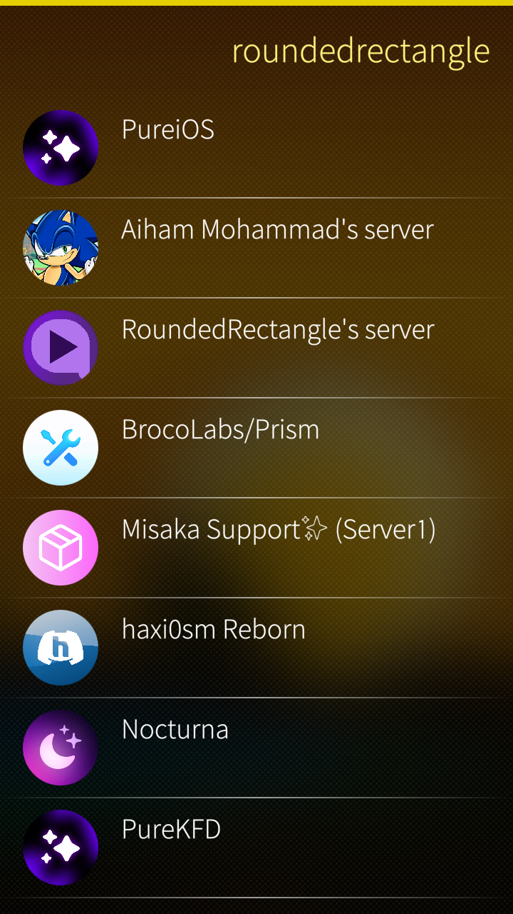
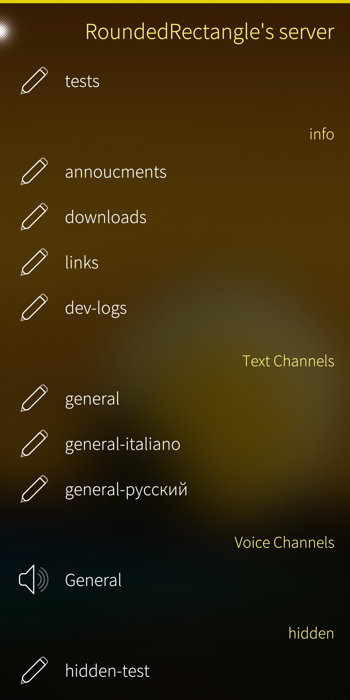
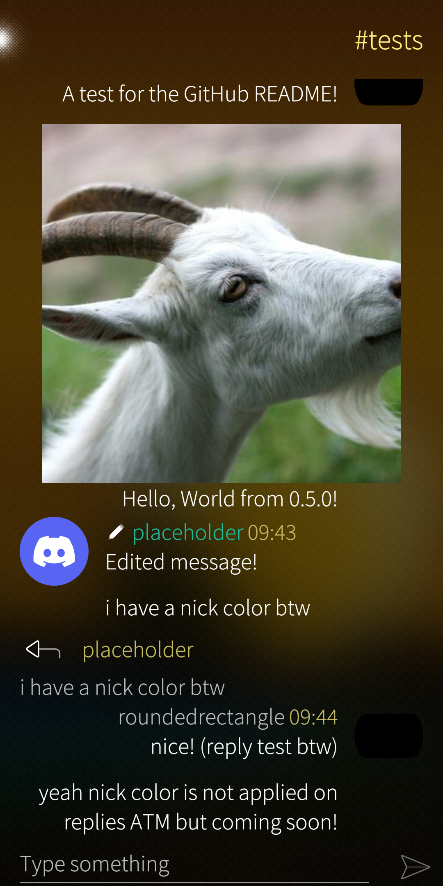
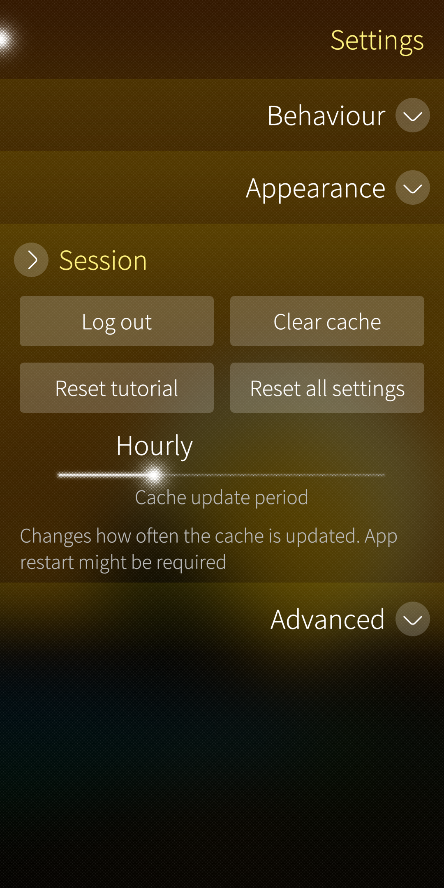
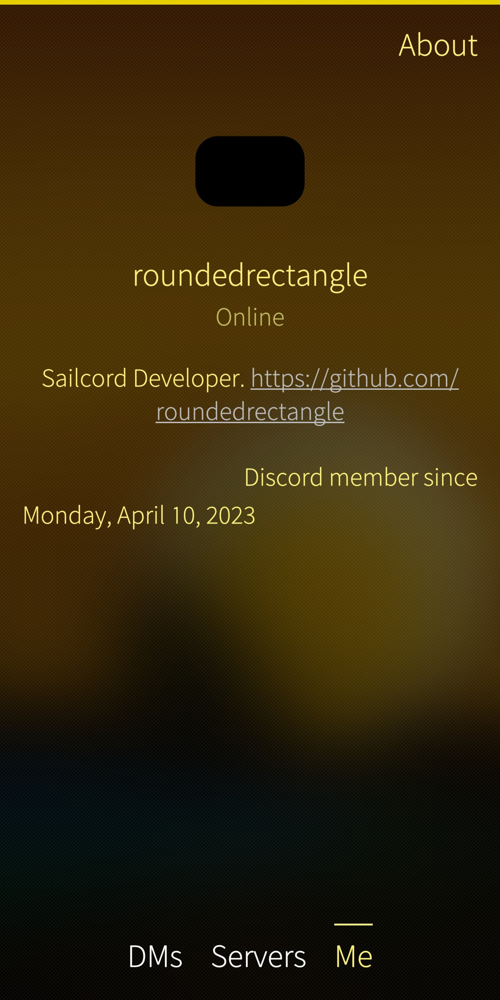

# SailDiscord

An unofficial SailfishOS Discord client

Very very WIP

**By using this, you are breaking Discord Terms of Services! This app might even get you banned! It stores your token in plain text and it is really easy to hack you with it!**

<!--Join our telegram [channel](https://t.me/saildiscord) with detailed development logs!

For testing functionality and my other projects you can use our discord [server](https://discord.gg/Q3u7ejjzFg).

I can forget about my projects and pause the developing, but then I come back (not always). I'm also new to developing SailfishOS apps, and it's really hard to find how to develop them.-->

## TODO

- [X] Login using Discord
- [X] Connect Python
- [X] Servers
- [ ] Text channels
	- [X] Text
	- [ ] Other types (photos, gifs, etc.)
- [ ] DMs
- [X] Settings
- [X] About page
- [ ] Caching
	- [X] Avatars
- [ ] Automate translating, maybe with something like weblate
- [ ] More features?

## Known issues
- Server list does not follow same sorting as in the real discord. *probably not possible yet because this is not implemented in discord.py-self*
- App lags in a text channel sometimes
- App is very slow at loading almost everything. This is not fully fixable because app uses Python as the backend, which is slow

## Screenshots

	
	
	
	
	

*Screenshots are for version 0.3.2*

## Build

### Removing the debug flag (disabling faster build)

Get Sailfish IDE, open the project, open Other Files -> rpm -> `SailDiscord.spec`, then replace `no` in the first line with `yes` if you want to make a production package. Now just run or build.

### Faster build (not to package the library, **NOT RECOMMENDED IN PRODUCTION**)

If you didn't replace, you'll get faster build but aditional steps needed for phone. This is needed only once. Once the installation is completed, open Terminal from the developer options on your phone and type this command:

	python3 -m pip install --user --upgrade "discord.py-self>=2.0" "requests" "Pillow"

Then open the app. If you ever want to switch back to the production version, type this command to undo:

	python3 -m pip uninstall discord.py-self

### Some general build issues

- ~You might need to remove the build_folder/deps/google/_upb folder~ Should not be needed now.
- ~There's an issue that the `BuildRequires: python3-pip;` line in the spec file throws an error. A workaround for now is to build these two awesome projects for the same target as for this project - [harbour-moremahjong](https://github.com/poetaster/harbour-moremahjong) and [sailfish-rpn-calculator](https://github.com/poetaster/sailfish-rpn-calculator).~
	- ~A fix could be to use `python3 -m ensurepip --default-pip` instead of `BuildRequires: python3-pip;` in the spec, but it might break the build vm/container so I am not recommending it. You can still do so by uncommenting a line in the spec file.~
	- The fix has been found, and it turns out very simple. Open the project in Sailfish IDE, right click on it in the file structure and click Run QMake.
- You might need to `cd` into the build folder, run `sfdk config target=<a target>` and then `sfdk build-shell --maintain`, finally inside that shell run `python3 -m pip install --upgrade pip`.

## Credits

The code is based on:

- [SailfishOS telegram client Fernschreiber](https://github.com/Wunderfitz/harbour-fernschreiber)
- [sailfish-rpn-calculator](https://github.com/lainwir3d/sailfish-rpn-calculator), and its [@poetaster's fork](https://github.com/poetaster/sailfish-rpn-calculator)

Core functionality:

- [discord.py-self library](https://github.com/dolfies/discord.py-self)
- [Opal](https://github.com/Pretty-SFOS/opal) ([Opal.About](https://github.com/Pretty-SFOS/opal-about))

Developers:

- [@roundedrectangle](https://github.com/roundedrectangle) (me)

Contributors (translations):

- [@legacychimera247](https://github.com/legacychimera247) - Italian
